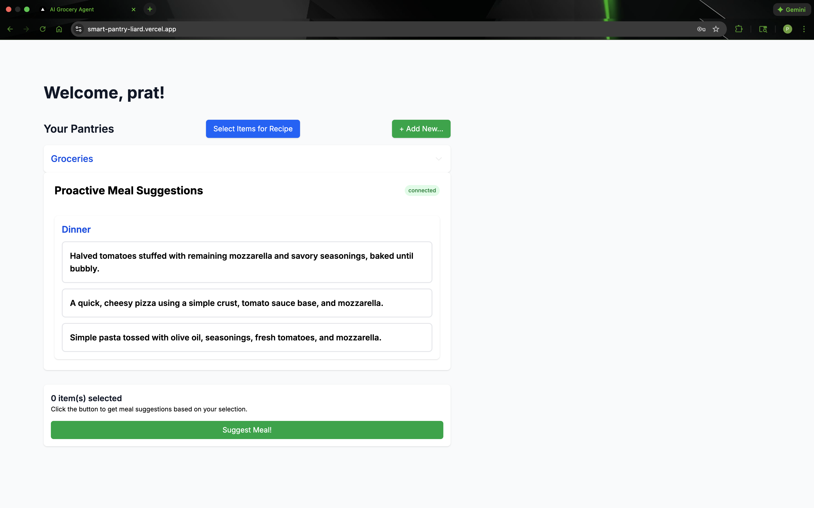

# AI-Powered Household Food Inventory Manager & Meal Planner


An intelligent full-stack application that solves the 'what's for dinner problem' and reduces food wastage by combining real-time food inventory tracking with semantic and proactive meal recommendations.

<br/>

<h2 align="center">🚀 Live Production App</h2>

<p align="center">
  <a href="https://smart-pantry-liard.vercel.app/" target="_blank">
    
  </a>
</p>

<br/>

<p align="center">
  <a href="https://smart-pantry-liard.vercel.app/" target="_blank">
    
  </a>
</p>
---

## 📸 Demo

### Manual Meal Generation (User-Triggered)
[](https://youtu.be/1OgnhLsvLvk)

### Proactive Meal Suggestions
[](https://youtu.be/br5_VpD816I)

---

## 🚀 Key Features

* **Agentic Inventory Management:** Goes beyond simple CRUD by simulating an intelligent kitchen manager. The system tracks groceries from purchase to consumption, automatically deducting ingredients as meals are logged.
* **Proactive "AI Chef" Agents:** Utilizes **Celery Beat** and background workers to autonomously generate meal suggestions throughout the day (Breakfast, Lunch, Dinner) based on *current* inventory expiration dates and time of day, without waiting for user prompts.
* **Zero-Waste Logic:** The AI prioritizes ingredients that are closest to expiring, dynamically adjusting recipe suggestions to minimize food waste.
* **Real-Time Agent Feedback:** Uses **WebSockets** to stream the AI's "thought process" and recipe generation status back to the user in real-time.
* **Cloud-Native Architecture:**
    * **Frontend:** Deployed on **Vercel** for global edge caching.
    * **Backend:** Dockerized microservices (API, Workers, Beat, Redis) running on **AWS EC2** behind an **Nginx** reverse proxy.
    * **Database:** Managed **AWS RDS (PostgreSQL)** for production-grade reliability.

---

## 🛠️ Tech Stack

### Cloud & DevOps
* **AWS EC2:** Hosting Dockerized backend services.
* **AWS RDS:** Managed PostgreSQL database.
* **Vercel:** Frontend deployment and CI/CD.
* **Nginx:** Reverse proxy and SSL termination.
* **Docker & Docker Compose:** Orchestrating the API, Celery Beat, Celery Workers, and Redis containers.

### Backend
* **Framework:** Python (FastAPI).
* **Agentic Workflow:** Celery (Beat & Workers) + Redis for autonomous scheduling and task queues.
* **AI:** LLM integration for context-aware recipe generation.

### Frontend
* **Framework:** React / Next.js.
* **Live Updates:** WebSocket connections for real-time meal updates.

---

## 📂 Documentation & Architecture

To keep this README clean, detailed engineering decisions are documented separately:

* **[System Architecture](docs/ARCHITECTURE.md):** High-level diagrams and explanation of the async worker flow.
* **[Trade-offs & Decisions](docs/TRADEOFFS_AND_DECISIONS.md)** 
* **[Roadmap](docs/ROADMAP.md):** Future plans, including scalability improvements for LLM costs.
---

## ⚡ Local Setup & Installation

To run the full "Smart Kitchen" agent ecosystem locally (independent of the AWS production environment), use the provided Docker Compose configuration. This spins up the API, background workers, Redis, and a local PostgreSQL instance.

### Prerequisites
* Docker & Docker Compose
* API Keys for LLM Provider (See `.env.example`)

### Steps

1.  **Clone the repository**
    ```bash
    git clone [https://github.com/pmg5408/grocery-meal-agent.git](https://github.com/pmg5408/grocery-meal-agent.git)
    cd pantry-planner
    ```

2.  **Environment Configuration**
    Create a `.env` file. Note that `docker-compose.yml` defaults to the following local DB credentials, so you only need to add your LLM keys.
    ```bash
    cp .env.example .env
    ```
    *Ensure your .env matches the docker-compose defaults:*
    * `POSTGRES_USER=pantry`
    * `POSTGRES_PASSWORD=pantry`
    * `POSTGRES_DB=pantry`
    * `DATABASE_URL=postgresql://pantry:pantry@db:5432/pantry`

3.  **Launch the System**
    ```bash
    docker-compose up --build
    ```

4. **Setup the Frontend**
    ```bash
    cd frontend

    # Install dependencies (Required)
    npm install

    # Start the development server
    npm run dev

* **Backend API:** `http://localhost:8000`
* **Local Database:** Accessible on port `5433`
* **The Frontend:** Available at `http://localhost:3000`
---

## 📬 Contact & Links

* **Created by:** Pratham(Prat) Gala
* **LinkedIn:** https://www.linkedin.com/in/pratham-gala/
